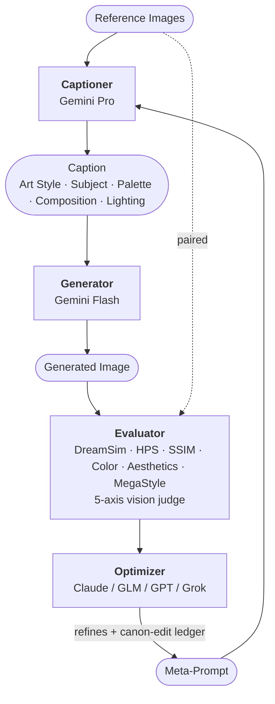

# Art Style Search

Self-improving loop that finds the best prompt to define and follow an art style from reference images. A meta-prompt instructs a captioner (Gemini Pro) how to describe images so a generator (Gemini Flash) can recreate them from the captions. A reasoning model (Claude, GLM-5.1, GPT-5.4, or Grok 4.20) optimizes the meta-prompt through hypothesis-driven experiments.

Every model in the stack is swappable: `--reasoning-provider` picks the optimizer, `--comparison-provider` picks the vision judge (Gemini or Grok), and `--bootstrap-captioner claude` optionally routes the one-time zero-step (20-ref captioning + parallel visual analysis) through Anthropic Claude for a richer initial style read.

Inspired by [karpathy/autoresearch](https://github.com/karpathy/autoresearch).

## How It Works



The `[Art Style]` block of every caption is the meta-prompt's `style_foundation` copied verbatim; the same canon (plus its MUST/NEVER invariants) is fed to the generator's system prompt. The zero-step captioning + parallel visual analysis can be routed through Claude via `--bootstrap-captioner claude`.

The meta-prompt is the only external artifact being optimized — but its whole **structure** is part of the search space, not just the text inside fixed slots. Each iteration the reasoner can rewrite any section's content, add new sections, drop or rename existing ones (beyond the two required anchors), reorder the `[Section]` labels the captioner emits (`caption_sections`), adjust the per-caption word-count target (`caption_length_target`), and edit the `negative_prompt`. Two anchors are fixed: `style_foundation` must be first and `subject_anchor` must be second; everything else is open.

`style_foundation` **is the style canon** — third-person declarative assertions about how this specific art style renders (medium, shading, color principle, surface texture, MUST/NEVER invariants). The captioner copies that canon verbatim into every `[Art Style]` caption block; the generator reads it as the style descriptor. Iteration-to-iteration learning is tracked in a canon-edit ledger so the reasoner can see "I tried tightening Color Principle last iteration; vision_subject improved +0.08, vision_style dropped −0.02."

### Optimization Loop

0. **Zero-step**: Fix the reference images. Caption them, run parallel style analysis (Gemini vision + reasoning model) to build a `StyleProfile` and N diverse initial meta-prompts.
1. **Propose**: the reasoning model emits a single JSON batch of 8-12 raw hypotheses grouped into 3 mechanism-tagged directions (`D1`/`D2`/`D3`), each carrying 1 targeted proposal (one section changed) + 1-3 bold proposals (up to 3 related sections). The workflow dedups duplicates on `(category, failure_mechanism, intervention_type)` and selects up to `--num-branches` experiments to evaluate. Selection picks one targeted per direction first, then fills remaining slots with bolds — while enforcing a **category quota** (max 2 proposals per `target_category` in a portfolio) so a reasoner batch that all fires at one section can't collapse the iteration.
2. **Run**: each experiment runs in parallel -- caption all references with the proposed meta-prompt, generate images from captions, evaluate against originals.
3. **Rank & synthesize**: experiments are ranked by an adaptive composite score; the top 2-3 are merged into a synthesized template (picks the best section from each) even if none individually beat the baseline.
4. **Pairwise vision comparison** (SPO-inspired): the top two experiments' reproductions are sent to Gemini vision for a head-to-head verdict, and the rationale is fed back into the next iteration.
5. **Independent review** (CycleResearcher-inspired): a skeptical reviewer assesses every experiment as SIGNAL/NOISE/MIXED and writes strategic guidance that is prepended to the next iteration's proposal prompt.
6. **Replicate gate** (optional, `--replicates N`): when enabled, the top candidate and the current incumbent are each re-run N times; promotion requires both hard dominance (`min(candidate) > max(baseline)` across replicates) AND an epsilon-clearing median delta. Without replicates (default), the single-shot `composite > baseline + epsilon` check is used.
7. **Apply**: best experiment becomes the new baseline (or, on even plateau counts, the second-best is adopted as an exploration move). All results feed a shared Knowledge Base that tracks hypothesis chains, per-category progress, confirmed insights, rejected approaches, and open problems.
8. **Repeat** until convergence (max iterations, plateau window, or the reasoning model signals stop).

## Cost & resources

Running this loop is not free. Know the order-of-magnitude before you start:

- **API calls**. The default `--protocol short` runs 3 iterations × 9 branches × 20 references -- on the order of 540 Gemini Pro captions, 540 Gemini Flash generations, 540 image-comparison calls (Gemini by default, optionally Grok), and ~10-15 reasoning-model calls. `--protocol classic` extends that with up to 5 more iterations on the short run's output. `--replicates 3` roughly triples the per-iteration cost (candidate + incumbent each replicated). Expect low single-digit US dollars for a short run and several US dollars for short+classic at current 2026 prices.
- **First-run ML model downloads**. The first invocation pulls ~3 GB of weights from Hugging Face Hub: DreamSim `dino_vitb16` (~870 MB), LAION-Aesthetics CLIP-L, HPSv2 CLIP-H, and the [MegaStyle-Encoder](https://huggingface.co/Gaojunyao/MegaStyle) fine-tune of SigLIP SoViT-400M (~860 MB) for the content-disentangled style-similarity axis. These are cached under `~/.cache/huggingface/` plus the local package caches used by DreamSim/OpenCLIP.
- **GPU is optional**. CPU works but is slow. Apple Silicon uses MPS automatically. NVIDIA CUDA users have to pick a matching `torch` wheel (see Troubleshooting).
- **Smoke-test recipe** (~1% of the cost of a default run):

  ```bash
  uv run python -m art_style_search \
    --protocol classic --max-iterations 1 \
    --num-branches 1 --raw-proposals 8 --num-fixed-refs 3 \
    --run smoke-test --new
  ```

  This runs one iteration with one experiment against three images -- enough to validate the full pipeline end-to-end (downloads, captioning, generation, evaluation, state persistence) without burning budget. `--protocol classic` is required here because `short` hard-clamps `max_iterations` to 3.

## Prerequisites

- Python >= 3.11
- [uv](https://docs.astral.sh/uv/) package manager
- [Google API key](https://aistudio.google.com/apikey) (for Gemini models -- always required)
- One of:
  - [Anthropic API key](https://console.anthropic.com/) (for Claude -- default)
  - [Z.AI API key](https://z.ai/) (for GLM-5.1 -- alternative)
  - [OpenAI API key](https://platform.openai.com/) (for GPT-5.4 -- alternative)
  - [xAI API key](https://console.x.ai/) (for Grok 4.20 reasoning and/or comparison)

## Quick Start

```bash
# Install dependencies
uv sync

# Configure API keys
cp .env.sample .env
# Edit .env with your keys

# Add reference images
# Drop at least 20 images of the target art style in reference_images/,
# or pass --num-fixed-refs N to match however many you have (minimum 3 for the smoke test).

# Run the optimization loop with the default short protocol (creates runs/run_001/)
uv run python -m art_style_search

# Resume or create a named run (same name → resume; add --new to error if it exists)
uv run python -m art_style_search --run my-experiment

# Two-phase run: cheap short foundation, then deep classic refinement on top
uv run python -m art_style_search --run my-style                      # phase 1: 3-iter short
uv run python -m art_style_search --run my-style --protocol classic   # phase 2: up to 5-iter classic

# One-shot classic with the A1 replicate gate (recommended for final polish)
uv run python -m art_style_search --run my-style --protocol classic --replicates 3

# View all options
uv run python -m art_style_search --help

# List all runs with status
uv run python -m art_style_search list

# Clean a specific run or all runs
uv run python -m art_style_search clean --run run_001
uv run python -m art_style_search clean --all
```

## CLI Options

| Flag | Default | Description |
|------|---------|-------------|
| `--reference-dir` | `reference_images` | Directory containing reference art |
| `--runs-dir` | `runs` | Base directory for all runs |
| `--run` | auto | Run name (auto-incremented if omitted) |
| `--new` | | Force new run (error if name exists) |
| `--max-iterations` | `5` | Maximum optimization iterations (classic pass). `short` hard-clamps to 3. |
| `--plateau-window` | `3` | Iterations without improvement before stop |
| `--num-branches` | `9` | Parallel experiments per iteration (portfolio size after selection). Category quota caps at 2 per `target_category`. |
| `--raw-proposals` | `9` | Raw proposals per iteration before portfolio selection (range 8-12) |
| `--num-fixed-refs` | `20` | Fixed reference images for optimization |
| `--protocol` | `short` | `short` (default, 3-iter cheap foundation pass) or `classic` (5-iter refinement pass, usually resumes on top of a short run). |
| `--replicates` | `1` | A1 paired-replicate promotion gate. `1` = single-shot (default). Values ≥ 2 enable the replicate gate: candidate's min replicate must beat baseline's max, AND candidate's median must clear baseline + epsilon. Recommended `3` for classic refinement on runs where branch-level variance drowns the signal. |
| `--seed` | random | RNG seed for reproducible reference selection |
| `--aspect-ratio` | `1:1` | Aspect ratio for generated images |
| `--caption-model` | `gemini-3.1-pro-preview` | Gemini model for per-iteration captioning |
| `--generator-model` | `gemini-3.1-flash-image-preview` | Gemini model for generation |
| `--reasoning-provider` | `anthropic` | Reasoning provider: `anthropic`, `zai`, `openai`, `xai`, or `local` |
| `--reasoning-model` | auto | Model name (default: `claude-opus-4-7` / `glm-5.1` / `gpt-5.4` / `grok-4.20-reasoning-latest`) |
| `--reasoning-effort` | `medium` | Reasoning-model effort (`low`/`medium`/`high`). Anthropic: `low`=thinking disabled, `medium`=adaptive, `high`=16k budget. OpenAI: maps to `reasoning.effort`. Z.AI/xAI/local: dropped with a one-time warning. |
| `--comparison-provider` | `gemini` | Image comparison provider: `gemini` or `xai` |
| `--comparison-model` | auto | Comparison model name (default: caption model for `gemini`, `grok-4.20-reasoning-latest` for `xai`) |
| `--reasoning-base-url` | none | Required with `--reasoning-provider local`; base URL for an OpenAI-compatible server |
| `--bootstrap-captioner` | `gemini` | Zero-step provider (`gemini` or `claude`). Controls BOTH the one-time 20-ref captioning AND the parallel visual analysis of those images that seeds the first meta-prompt. Per-iteration captioning and the vision judge are unaffected. `claude` requires `ANTHROPIC_API_KEY`. |
| `--bootstrap-caption-model` | `claude-opus-4-7` | Anthropic model used for both zero-step surfaces when `--bootstrap-captioner claude`. `--caption-thinking-level` maps to Anthropic effort (MINIMAL/LOW → `low`, MEDIUM → `medium`, HIGH → `high`). |
| `--caption-thinking-level` | `MINIMAL` | Gemini Pro captioner extended-thinking level (`MINIMAL`/`LOW`/`MEDIUM`/`HIGH`). `MEDIUM` materially improves medium identification + proportion precision at 2-3x latency. |
| `--generation-thinking-level` | `MINIMAL` | Gemini Flash image-generator extended-thinking level. |
| `--gemini-concurrency` | `50` | Max concurrent Gemini API calls |
| `--eval-concurrency` | `4` | Max concurrent eval threads |

## Troubleshooting

- **`torch` wheel doesn't match CUDA**. `uv sync` pulls the CPU wheel by default. NVIDIA CUDA users need to override the index: `uv pip install torch torchvision --index-url https://download.pytorch.org/whl/cu124` (pick the channel that matches your CUDA version).
- **Apple Silicon**. Works out of the box -- the code detects MPS automatically via `torch.backends.mps.is_available()` and uses it for DreamSim / HPS / aesthetics inference.
- **Hugging Face download failures on first run**. The first invocation pulls ~2 GB of weights. If downloads fail with rate-limit errors, rerun once the limit resets. If the cache directory isn't writable, set `HF_HOME=/path/to/writable/cache` before running.
- **Missing API keys**. The CLI refuses to start and tells you exactly which env var to set. Mapping: `GOOGLE_API_KEY` (always required, Gemini captioning/generation and zero-step analysis), `ANTHROPIC_API_KEY` (for `--reasoning-provider anthropic`), `ZAI_API_KEY` (for `zai`), `OPENAI_API_KEY` (for `openai`), `XAI_API_KEY` (for `--reasoning-provider xai` and/or `--comparison-provider xai`).
- **Using a local reasoning model**. `--reasoning-provider local` skips third-party reasoning API keys, but it does require both `--reasoning-model` and `--reasoning-base-url`, for example `--reasoning-base-url http://localhost:8000/v1`.
- **Empty `reference_images/`**. The loop raises `FileNotFoundError` with an actionable message. Drop at least `--num-fixed-refs` images of a supported type (see `IMAGE_EXTENSIONS` in `utils.py`).
- **`KeyError: 'branches'` when resuming**. Your `state.json` predates the branch-based → shared-KB refactor. Delete the old state and start a new run with `--new`.
- **Old `--protocol rigorous` state on resume**. State schema v8 removed the rigorous protocol; legacy state files with `protocol="rigorous"` are auto-migrated to `classic` on load (with `feedback_refs`/`silent_refs` dropped). If you relied on statistical-testing promotion, use `--protocol classic --replicates 3` for the equivalent A1 paired-replicate gate.

## Evaluation Metrics

Each metric compares a generated image against its specific paired original; weights sum to 1.00:

| Metric | Weight | Measures | Better |
|--------|--------|----------|--------|
| **DreamSim** | 34% | Human-aligned perceptual similarity | Higher |
| **Color histogram** | 17% | HSV histogram intersection | Higher |
| **HPS v2** | 7% | Caption-image alignment (normalized / 0.35) | Higher |
| **MegaStyle** | 8% | Cosine similarity in the [MegaStyle-Encoder](https://arxiv.org/abs/2604.08364) embedding (SigLIP SoViT-400M fine-tuned on 1.4M style-paired images) — content-disentangled style-space signal, independent of DreamSim and the vision judge. Primary style-similarity weight since the homescapes rebalance showed the ternary `vision_style` judge systematically demoting high-MegaStyle branches. | Higher |
| **Vision (subject)** | 7% | Gemini ternary subject fidelity (paired with subject-floor penalty) | Higher |
| **Aesthetics** | 6% | Visual quality (LAION predictor, 1-10) | Higher |
| **SSIM** | 6% | Structural similarity index | Higher |
| **Vision (composition)** | 4% | Gemini ternary spatial layout | Higher |
| **Vision (style)** | 3% | Gemini ternary style fidelity — regression-alarm role since the rebalance (MegaStyle is now the primary style weight). | Higher |
| **Style consistency** | 3% | Jaccard overlap of [Art Style] blocks (canon-pull-through alarm; demoted from 8% when MegaStyle was added since token-overlap on captions has Spearman ≈0 with image-space style similarity) | Higher |
| **Vision (proportions)** | 3% | Gemini ternary head-heights + character archetype | Higher |
| **Vision (medium)** | 2% | Gemini ternary agreement on rendering medium (plain observable vocabulary) | Higher |

Additional penalties (subtracted from the weighted sum, floor-clamped to 0):

- **Variance penalty** (×0.30): mean of per-image DreamSim and color-histogram std — punishes inconsistent reproduction across images.
- **Completion penalty** (×0.15): `1 - completion_rate`, punishes experiments that drop images.
- **Compliance penalty** (×0.08): `1 - mean(compliance rates)` over topic coverage, marker coverage, section ordering, section balance, subject specificity, **style-canon fidelity** (the caption's `[Art Style]` block reproduces the meta-prompt's `style_foundation` canon verbatim — LCS char-ratio via `difflib.SequenceMatcher`), and **observation-boilerplate purity** (observation blocks stay free of canon text — token-trigram overlap with the canon).
- **Ref-shortfall penalty** (×0.04): fraction of requested reference images that were skipped.
- **Subject-floor penalty** (×0.05): triggers only when `vision_subject < 0.35`, scaling linearly to the floor.

`per_image_composite` applies the same base weights minus `style_consistency` (experiment-level only) and without any penalties — max output 0.97 (includes the MegaStyle per-image signal). Used for the paired-replicate promotion decision when `--replicates > 1`.

## Protocol Modes

The loop ships with two protocols; choose per-run via `--protocol`.

### Short (default, 3-iter foundation)

`--protocol short` is the cheap coarse pass. It runs **3 iterations** (hard-clamped — any `--max-iterations` value above 3 is ignored; smaller values still work), produces a `state.json` that is directly resumable by `classic`, and is the right default for:

- Batch-scanning a new reference set where you don't know yet whether the zero-step meta-prompt already nails it.
- Runs where baseline metrics are near-ceiling on most axes (improvements would need to come from canon-edits, not sweeping structural changes).
- Budget-bound pipelines where you want a known ~35%-of-classic footprint.

### Classic (5-iter refinement pass)

`--protocol classic` is the deeper pass. It runs up to `--max-iterations` (default `5`) and **usually resumes on top of a prior short run** — the state.json, canon-edit ledger, knowledge base, and style-gap observations all carry through, giving the reasoner full history from the coarse pass. Recommended combination with `--replicates 3` to enable the A1 paired-replicate gate.

```bash
uv run python -m art_style_search --run my-style                                    # phase 1
uv run python -m art_style_search --run my-style --protocol classic --replicates 3  # phase 2
```

### Shared observability

Both protocols always write:

- **`run_manifest.json`** — seed, git SHA, model versions, reference-image hashes, platform. Seed/protocol drift on resume is warned-but-allowed (so short→classic resume works).
- **`promotion_log.jsonl`** — every iteration's promotion decision (score, delta, epsilon, decision, replicate scores if active) for post-hoc audit.
- **`canon_edit_ledger`** — cross-iteration record of canon edits + measured effect, rendered back to the reasoner on the next iteration so it sees "last time I tightened Color Principle, vision_style dropped −0.02."

## Project Structure

```
src/art_style_search/
  __main__.py             Entry point + list/clean/report subcommands
  loop.py                 Façade re-exporting workflow.run
  workflow/               Internal orchestration (context, iteration phases, policy, services, zero-step, replicate gate)
  prompt/                 Reasoning-model interface (proposals, synthesis, review, JSON contracts, parsing, canon ops)
  analyze.py              Zero-step: parallel visual (Gemini or Claude) + reasoning-model style analysis
  caption.py              Gemini Pro (per-iteration) + Anthropic Claude (zero-step bootstrap) captioning with disk cache
  caption_sections.py     [Section] parser + subject-first generator prompt builder
  generate.py             Gemini Flash image generation with retry
  experiment.py           Single-experiment caption→generate→evaluate pipeline + replicated evaluation (A1)
  evaluate.py             Per-image paired metrics + Gemini vision comparison + caption compliance
  scoring.py              Composite scoring (base + headroom-weighted), per-image scoring, replicate promotion gate
  knowledge.py            Knowledge Base maintenance (hypothesis tracking)
  models.py               Lazy-loaded DreamSim/HPS/Aesthetics/SSIM/MegaStyle-Encoder models
  taxonomy.py             CATEGORY_SYNONYMS — canonical hypothesis category synonyms
  contracts.py            Transient workflow dataclasses (Lessons, RefinementResult, ExperimentProposal)
  reasoning_client.py     Provider-agnostic ReasoningClient (Anthropic/OpenAI/xAI/Z.AI/local)
  retry.py                async_retry + rate-limit and circuit-breaker helpers
  media.py                MIME map, IMAGE_EXTENSIONS, xAI data-URL helpers
  runs.py                 Run directory management (isolation, listing, cleanup)
  state.py                Public JSON persistence API (loaders/writers, manifest, promotion log)
  state_codec.py          Low-level encoders/decoders for persisted dataclasses
  state_migrations.py     Schema versions + backward-compat payload migrations
  types.py                Shared dataclasses (MetricScores, AggregatedMetrics, KnowledgeBase, ...)
  config.py               CLI argument parsing → Config
  utils.py                Shared helpers (CATEGORY_SYNONYMS re-export, build_ref_gen_pairs, ...)
  report.py               HTML report façade
  report_data.py          ReportData — centralized data loading for reports
  reporting/              HTML rendering (charts, document assembly, section renderers, CSS)
```

## Development

This project uses [`uv`](https://docs.astral.sh/uv/) as the package and tool manager. Every Python command goes through `uv run`, and external CLI tools should be installed via `uv tool install <name>` so they stay isolated from your system Python.

```bash
uv sync                  # Install/update dependencies
uv run ruff check .      # Lint
uv run ruff format .     # Format
uv run pytest tests/     # Run tests
```

Ruff handles both linting and formatting (config in `pyproject.toml`, line length 120).

Optional — enable the [`gitleaks`](https://github.com/gitleaks/gitleaks) secret-scanning hook from `.pre-commit-config.yaml` so accidentally-staged API keys are caught before they reach history:

```bash
uv tool install pre-commit   # Install the pre-commit CLI (isolated via uv)
pre-commit install           # Wire it into .git/hooks/pre-commit
```

For a full git-history secret scan before publishing, run the dedicated GitHub Actions workflow in [`.github/workflows/gitleaks.yml`](.github/workflows/gitleaks.yml) or install the `gitleaks` CLI locally and run `gitleaks git .`.

## Contributing

Contributor workflow lives in [`CONTRIBUTING.md`](CONTRIBUTING.md). Security reporting guidance lives in [`SECURITY.md`](SECURITY.md).

## Acknowledgements

This project stands on the shoulders of:

- [**DreamSim**](https://github.com/ssundaram21/dreamsim) (Fu et al.) -- human-aligned perceptual similarity, the main reproduction metric.
- [**HPS v2**](https://github.com/tgxs002/HPSv2) (Wu et al.) -- human preference score for caption-image alignment.
- [**MegaStyle**](https://arxiv.org/abs/2604.08364) (Gao et al. 2026) -- MegaStyle-Encoder (SigLIP SoViT-400M fine-tuned on 1.4M style-paired images) provides the content-disentangled style-space cosine-similarity axis.
- [**LAION-Aesthetics-Predictor-v2**](https://laion.ai/blog/laion-aesthetics/) via [`simple-aesthetics-predictor`](https://github.com/shunk031/simple-aesthetics-predictor).
- [**scikit-image**](https://scikit-image.org/) -- SSIM implementation.
- [**Google Gemini**](https://ai.google.dev/) -- captioner, image generator, and default vision comparator.
- [**Anthropic Claude**](https://www.anthropic.com/) / [**Z.AI GLM-5.1**](https://z.ai/) / [**OpenAI GPT**](https://openai.com/) / [**xAI Grok**](https://x.ai/) -- interchangeable reasoning backends, with Grok also available for image comparison.
- [**karpathy/autoresearch**](https://github.com/karpathy/autoresearch) -- the self-improving research-loop pattern that inspired this project.

## License

[MIT](LICENSE) -- see the `LICENSE` file for details.
